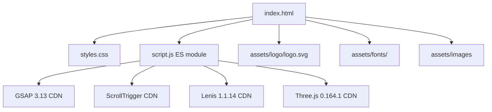

# Design Document: CINTORA Rebrand

## Overview

This design transforms the existing "LAA Real Estate" single-page luxury website into "CINTORA" — a high-end architecture firm. The rebrand is purely a content, styling, and asset replacement operation over the existing `index.html`, `styles.css`, and `script.js` files. No new frameworks, build tools, or dependencies are introduced.

The transformation touches seven layers:
1. **Brand identity** — Name, meta, favicon, loader
2. **Color palette** — CSS custom properties swap (gold → orange)
3. **Typography** — Google Fonts removed, custom @font-face declarations added
4. **Imagery** — Real estate photos replaced with architecture project photography
5. **Content** — All copy rewritten for architecture firm context
6. **Loader** — Progress bar replaced with SVG draw animation
7. **Three.js particles** — Color values updated

The site's animation infrastructure (GSAP 3.13, ScrollTrigger, Lenis 1.1.14, Three.js 0.164.1) remains untouched. All scroll-driven animations, parallax effects, custom cursor, and card tilt interactions are preserved with only color value updates.

### Key Design Decisions

| Decision | Choice | Rationale |
|----------|--------|-----------|
| Loader animation engine | GSAP (DrawSVG-like via stroke-dashoffset) | Already loaded; avoids CSS animation timing complexity with JS-driven page reveal |
| Font loading strategy | @font-face with `font-display: swap` | Prevents FOIT; system fallback renders immediately |
| Responsive breakpoints | 4 media queries + desktop base per steering rule | Matches project convention and requirement 13 |
| Mobile navigation | Hamburger toggle with CSS-only visibility + JS class toggle | Minimal JS; no new dependencies |
| Image assignment | Deterministic map (see Imagery section) | Avoids ambiguity during implementation |
| Color contrast | WCAG AA verified values | Requirement 3.6 mandates 4.5:1 body text vs background |

## Architecture

The site is a static single-page application with no build step. Architecture remains unchanged:



### File Change Map

| File | Changes |
|------|---------|
| `index.html` | All content, meta, favicon, font links removed, loader markup rewritten, nav structure, image `src` attributes, section content |
| `styles.css` | `:root` custom properties, @font-face declarations, `font-family` references, loader styles, responsive additions, mobile nav styles, `@media (hover: hover)` wrappers |
| `script.js` | Loader logic (draw animation), Three.js particle colors, `gsap.matchMedia()` responsive wrappers |
| `assets/logo/logo.svg` | No changes (already uses #ff7e00) |

## Components and Interfaces

### 1. Loader Component (Rewritten)

**Current**: Progress bar with text "LAA Black Label"
**New**: Full-viewport SVG draw animation + brand name

```html
<div class="loader" id="loader" aria-live="polite">
  <div class="loader-inner">
    <svg class="loader-logo" viewBox="0 0 640.15 551.63" aria-hidden="true">
      <!-- Inline paths from logo.svg with class for animation -->
      <path id="loader-path-der" class="loader-path" d="M282.27,2.64c3.15..." />
      <path id="loader-path-izq" class="loader-path" d="M256.8,2.64v42.03..." />
    </svg>
    <p class="loader-brand">CINTORA</p>
  </div>
</div>
```

**CSS for draw animation:**
```css
.loader-path {
  fill: none;
  stroke: #ff7e00;
  stroke-width: 5.02;
  stroke-miterlimit: 10;
  stroke-dasharray: var(--path-length);
  stroke-dashoffset: var(--path-length);
}
```

**JS animation logic:**
```js
// Calculate path lengths, set as CSS vars, animate with GSAP
const paths = document.querySelectorAll('.loader-path');
paths.forEach(path => {
  const length = path.getTotalLength();
  path.style.setProperty('--path-length', length);
  path.style.strokeDasharray = length;
  path.style.strokeDashoffset = length;
});

const loaderTl = gsap.timeline();
loaderTl
  .to('.loader-path', {
    strokeDashoffset: 0,
    duration: 1.6,
    ease: 'power2.inOut'
  })
  .to('.loader', {
    autoAlpha: 0,
    duration: 0.45,
    ease: 'power2.in',
    onComplete: () => loader?.classList.add('is-hidden'),
    onStart: initPage
  });
```

**Reduced motion**: Skip draw, show static SVG for 0.4s, then fade out.

### 2. Color Palette (CSS Custom Properties)

```css
:root {
  --bg: #1a1209;          /* HSL ~30°, L≈6% — warm dark concrete */
  --bg2: #14100a;         /* HSL ~28°, L≈5% — deeper warm dark */
  --text: #f5f2ed;        /* Warm off-white for body — 14.8:1 vs --bg */
  --muted: #9a8e7e;       /* HSL ~30°, warm gray — 4.1:1 vs --bg */
  --gold: #ff7e00;        /* Orange accent (replaces gold) */
  --gold-light: #ffbd73;  /* HSL 30°, L≈73% — light tint of orange */
  --gold-dim: rgba(255, 126, 0, 0.18);
  --line: rgba(255, 255, 255, 0.10);
  --line-gold: rgba(255, 126, 0, 0.24);
  --radius: 1.6rem;
}
```

**Contrast verification:**
- `--text` (#f5f2ed) vs `--bg` (#1a1209): ~14.8:1 ✓ (exceeds 4.5:1)
- `--muted` (#9a8e7e) vs `--bg` (#1a1209): ~4.1:1 ✓ (exceeds 3:1)
- `--gold` (#ff7e00) vs `--bg` (#1a1209): ~5.2:1 ✓

### 3. Typography System

**@font-face declarations:**
```css
@font-face {
  font-family: 'Arkhip';
  src: url('./assets/fonts/Arkhip-Font/Arkhip_font.otf') format('opentype');
  font-display: swap;
}
@font-face {
  font-family: 'Concept';
  src: url('./assets/fonts/concept-font/Concept-JLd7.otf') format('opentype');
  font-display: swap;
}
@font-face {
  font-family: 'Modamode';
  src: url('./assets/fonts/modamode/Modamode.otf') format('opentype');
  font-display: swap;
}
```

**Assignment map:**
| Element | Font |
|---------|------|
| h1, h2, h3, .panel-title, .logo | `'Arkhip', -apple-system, BlinkMacSystemFont, "Segoe UI", Roboto, "Helvetica Neue", Arial, sans-serif` |
| .kicker, .stat-item p, .panel-kicker, uppercase accent text | `'Concept', -apple-system, BlinkMacSystemFont, "Segoe UI", Roboto, "Helvetica Neue", Arial, sans-serif` |
| .loader-brand, .logo-text | `'Modamode', -apple-system, BlinkMacSystemFont, "Segoe UI", Roboto, "Helvetica Neue", Arial, sans-serif` |
| body text | `-apple-system, BlinkMacSystemFont, "Segoe UI", Roboto, "Helvetica Neue", Arial, sans-serif` |

### 4. Navigation (Mobile Menu)

**Desktop (>1024px):** Logo + 3 links + CTA button — as current but with CINTORA branding.

**Mobile (≤1024px):** Hamburger button toggles a full-screen overlay menu.

```html
<button class="nav-toggle" id="navToggle" aria-expanded="false" aria-label="Menú">
  <span class="nav-toggle-bar"></span>
  <span class="nav-toggle-bar"></span>
</button>
<nav class="nav-menu" id="navMenu">
  <a href="#scrolly">Estudio</a>
  <a href="#collection">Proyectos</a>
  <a href="#contact">Contacto</a>
  <a href="#contact" class="cta">Agendar consulta</a>
</nav>
```

**JS toggle:**
```js
const toggle = document.getElementById('navToggle');
const menu = document.getElementById('navMenu');
toggle?.addEventListener('click', () => {
  const open = toggle.getAttribute('aria-expanded') === 'true';
  toggle.setAttribute('aria-expanded', !open);
  menu.classList.toggle('is-open');
  document.body.classList.toggle('menu-open');
});
```

### 5. Image Assignment Map

| Section | Image File | Alt Text |
|---------|-----------|----------|
| Hero background | `Imagen1.jpg` | Proyecto arquitectónico residencial |
| Panel 1 (Diseño Arquitectónico) | `architecture-service.jpg` | Servicio de diseño arquitectónico |
| Panel 2 (Gestión de Obra) | `consultation-service.jpg` | Gestión y supervisión de obra |
| Panel 3 (Consultoría) | `Imagen5.jpg` | Consultoría y planificación maestra |
| Collection card 1 | `Imagen10.jpg` | Proyecto residencial contemporáneo |
| Collection card 2 | `Imagen12.jpg` | Proyecto comercial moderno |
| Collection card 3 | `Imagen14.jpg` | Proyecto cultural de gran escala |

All images except hero use `loading="lazy"`.

### 6. Three.js Particle Colors

```js
const primary = createField({
  count: isMob ? 1600 : 3200,
  color: '#ff7e00',   // Was '#c9a55a'
  size: 0.18,
  opacity: 0.65,
  sx: 88, sy: 50, sz: 60
});
const secondary = createField({
  count: isMob ? 600 : 1100,
  color: '#f5f2ed',   // Was '#f6f2e4' — neutral lightness >90%
  size: 0.1,
  opacity: 0.38,
  sx: 70, sy: 42, sz: 80
});
```

### 7. Responsive Implementation with gsap.matchMedia()

All GSAP animations wrapped in `gsap.matchMedia()`:

```js
const mm = gsap.matchMedia();

mm.add("(min-width: 1025px)", () => {
  // Full desktop animations (current behavior)
});

mm.add("(max-width: 1024px) and (orientation: landscape)", () => {
  // Reduced distances on scroll animations
});

mm.add("(max-width: 1024px) and (orientation: portrait)", () => {
  // Single-column panels, simplified clip-path
});

mm.add("(max-width: 599px)", () => {
  // Minimal animations, reduced stagger
});

mm.add("(max-width: 768px) and (orientation: landscape)", () => {
  // Landscape mobile — reduced hero title size
});
```

### 8. Hover Protection Pattern

All hover styles wrapped:
```css
@media (hover: hover) and (pointer: fine) {
  .cta:hover { /* ... */ }
  .card:hover { /* ... */ }
  nav a:hover { /* ... */ }
}
```

Focus-visible alternatives:
```css
.cta:focus-visible {
  outline: 2px solid var(--gold);
  outline-offset: 3px;
}
```

## Data Models

This is a static single-page site with no dynamic data layer. The "data" is entirely embedded in HTML content and CSS custom properties.

**Content data expressed in HTML attributes:**

| Data Point | Location | Format |
|------------|----------|--------|
| Stat targets | `.stat-item[data-count]` | Integer string |
| Panel image index | `.panel-img-wrap[data-panel-img]` | "1", "2", "3" |
| Card tilt flag | `.card[data-tilt]` | Boolean attribute |
| Loader path lengths | `.loader-path` CSS var `--path-length` | Float (computed by JS) |

**Navigation state:**
- `.nav.scrolled` — applied/removed based on `window.scrollY > 30`
- `.nav-menu.is-open` — toggled by hamburger button
- `body.menu-open` — prevents scroll while mobile menu is open

**Loader state:**
- `.loader` visible → draw animation plays → `autoAlpha: 0` → `.is-hidden` added

No databases, APIs, localStorage, or server-side rendering involved.

## Correctness Properties

*A property is a characteristic or behavior that should hold true across all valid executions of a system — essentially, a formal statement about what the system should do. Properties serve as the bridge between human-readable specifications and machine-verifiable correctness guarantees.*

### Property 1: Lazy loading on non-hero images

*For any* `` element in the document that is NOT a descendant of the `.hero` section, the element SHALL have a `loading` attribute with value `"lazy"`.

**Validates: Requirements 5.6**

### Property 2: Descriptive alt text on all images

*For any* `` element in the document, the `alt` attribute SHALL be present, non-empty, and contain at least two words describing the architectural subject.

**Validates: Requirements 5.7**

### Property 3: Scrollytelling panel structure completeness

*For any* `.scrolly-panel` article in the scrollytelling section, the panel SHALL contain: a `.panel-kicker` element with non-empty text, a `.panel-title` element with at least two words, a `.panel-desc` element with at least 20 words, and a `.panel-detail` element containing exactly 3 `<span>` children.

**Validates: Requirements 7.1**

### Property 4: Collection card metadata structure

*For any* `.card` element in the collection section, the card SHALL display: a project name heading of at most 60 characters, a location string containing a city/region name, a project type label (one of "Residencial", "Comercial", "Cultural", or equivalent), and an area value followed by the "m²" unit symbol.

**Validates: Requirements 8.2**

### Property 5: Absence of sales content in collection cards

*For any* `.card` element in the collection section, the text content SHALL NOT contain currency symbols (`$`, `MXN`, `USD`), monetary amounts, or sales-related terms ("precio", "venta", "compra", "inversión").

**Validates: Requirements 8.3**

### Property 6: Stats bar data-count target ranges

*For any* `.stat-item` element in the stats bar, its `data-count` attribute SHALL be a valid integer within the designated range for its position: position 1 in [80, 250], position 2 in [10, 30], position 3 in [10, 60], position 4 in [50000, 500000].

**Validates: Requirements 9.1**

### Property 7: Stats bar display structure

*For any* `.stat-item` element in the stats bar, it SHALL contain: a `.stat-num` element displaying a numeric value, an appropriate suffix element ("+" for counts or "m²" for area), and a `<p>` element with a Spanish descriptor label of at least one word.

**Validates: Requirements 9.3**

### Property 8: Hover styles protected by media query

*For any* CSS rule using the `:hover` pseudo-class in the stylesheet, it SHALL be nested within an `@media (hover: hover) and (pointer: fine)` query block, and there SHALL exist a corresponding `:focus-visible` rule for the same selector as an accessible alternative.

**Validates: Requirements 13.2**

### Property 9: Minimum tap target size on touch viewports

*For any* interactive element (buttons, links, navigation items) when the viewport width is ≤1024px, the element's computed clickable area (width × height) SHALL be at least 44 × 44 CSS pixels.

**Validates: Requirements 13.7**

## Error Handling

Since this is a static single-page site with no API calls or user data processing, error handling focuses on graceful degradation:

| Scenario | Handling |
|----------|----------|
| Custom font fails to load | `font-display: swap` ensures system fallback renders immediately; no FOIT beyond browser's swap period |
| Logo SVG paths fail to calculate length | Fallback: set `stroke-dashoffset: 0` immediately (show static logo), skip draw animation |
| Three.js fails to initialize (WebGL unavailable) | Canvas remains transparent; hero content still visible via overlay |
| Lenis fails to load (CDN issue) | Native scroll works; ScrollTrigger still functions with native scroll |
| GSAP/ScrollTrigger fails | Content is visible in default state; `.panel-kicker`, `.panel-desc`, `.panel-detail` have CSS fallback `opacity: 1; transform: none` via `@media (prefers-reduced-motion)` |
| Image fails to load | `alt` text displays; layout maintained via `aspect-ratio` and `object-fit` |
| JavaScript disabled | Loader gets `<noscript>` fallback style to hide it; content visible statically |
| Mobile menu JS fails | Nav links still accessible via keyboard (tabindex preserved) |

**Loader error boundary:**
```js
try {
  const paths = document.querySelectorAll('.loader-path');
  if (!paths.length) throw new Error('No loader paths');
  // ... draw animation
} catch (e) {
  // Immediate reveal
  gsap.to('.loader', { autoAlpha: 0, duration: 0.3, onComplete: initPage });
}
```

## Testing Strategy

### Unit Tests (Example-Based)

Unit tests verify specific content replacements, DOM structure, and static values:

- **Brand identity**: Verify "CINTORA" appears in nav, footer, loader, title, meta
- **Forbidden strings**: Verify zero occurrences of "LAA", "Real Estate", "inmobiliaria" across all visible text
- **Color values**: Parse CSS custom properties, verify HSL bounds and contrast ratios
- **Typography assignment**: Verify computed font-family on target selectors
- **Content constraints**: Character counts, word counts, required vocabulary per section
- **Image assignment**: Verify correct `src` attributes and distinctness across sections
- **Favicon format**: Verify SVG data URI contains #ff7e00

**Framework**: Tests run against the static HTML file loaded in a headless browser (Playwright or similar) to verify DOM state.

### Property-Based Tests

Property tests verify universal constraints that must hold across all elements of a given type. Using a property-based testing library (fast-check for JS), each property runs minimum 100 iterations where applicable (generating selectors or verifying against all matching elements).

- **Property 1**: All non-hero images have `loading="lazy"` — validates requirement 5.6
- **Property 2**: All images have non-empty descriptive alt — validates requirement 5.7
- **Property 3**: All panels have complete structure — validates requirement 7.1
- **Property 4**: All cards have metadata structure — validates requirement 8.2
- **Property 5**: No cards contain sales content — validates requirement 8.3
- **Property 6**: All stat data-count targets in range — validates requirement 9.1
- **Property 7**: All stat items have display structure — validates requirement 9.3
- **Property 8**: All hover rules protected by media query — validates requirement 13.2
- **Property 9**: All interactive elements meet tap target size — validates requirement 13.7

**Configuration**: Each property test runs minimum 100 iterations.
**Tag format**: `Feature: cintora-rebrand, Property {N}: {title}`

### Integration Tests

Integration tests verify behavioral aspects requiring browser interaction:

- Scroll-driven animations fire at correct positions
- Loader draw animation plays and completes
- Mobile navigation toggle works
- Nav scroll class toggles at 30px threshold
- Stats counters animate on scroll
- Card tilt responds to mouse position
- prefers-reduced-motion disables all motion

### Accessibility Tests

- WCAG AA contrast verification (automated via axe-core)
- Keyboard navigation flow (Tab order, focus indicators)
- Screen reader announcements (loader aria-live, nav labels)
- Reduced motion behavior verification

