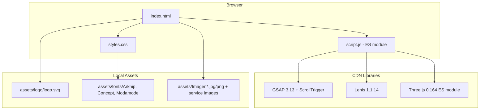

# Design Document — CINTORA Rebrand

## Overview

This design specifies the complete transformation of the "LAA Real Estate" single-page website into "CINTORA" — a high-end architecture firm brand. The rebrand touches every layer of the existing site: brand identity, color palette, typography, imagery, content copy, animated loader, and responsive behavior.

The implementation operates on three static files (`index.html`, `styles.css`, `script.js`) with no build tools. All changes propagate through CSS custom properties, HTML content replacement, `@font-face` declarations, and targeted JavaScript modifications for the loader and Three.js particle colors.

### Design Principles

1. **Preserve animation quality** — All GSAP ScrollTrigger, Lenis, Three.js, and micro-interaction code paths remain intact; only color values and content references change.
2. **CSS custom properties as the color API** — The existing variable names (`--gold`, `--bg`, etc.) are kept so every component inherits the new palette without selector changes.
3. **No external font services** — Local `@font-face` with `font-display: swap` replaces Google Fonts entirely.
4. **Responsive-first** — The steering rule mandates 4 breakpoints + desktop base, `gsap.matchMedia()` for JS animations, and `@media (hover: hover) and (pointer: fine)` for all hover styles.

---

## Architecture

The site architecture remains a single HTML page with two companion files. No new files are introduced beyond the already-present assets.



### Change Domains

| Domain | Files Modified | Mechanism |
|--------|---------------|-----------|
| Color palette | `styles.css` `:root` | Update CSS custom property values |
| Typography | `styles.css` + `index.html` `<head>` | `@font-face` declarations; remove Google Fonts links |
| Loader | `index.html` + `script.js` + `styles.css` | Inline SVG + GSAP stroke-dashoffset animation |
| Content | `index.html` | Pure text/attribute replacements |
| Images | `index.html` | `src` attribute updates to `assets/Imagen*.jpg` files |
| Particles | `script.js` | Change color hex in `createField()` calls |
| Responsive | `styles.css` + `script.js` | New breakpoint blocks + `gsap.matchMedia()` |
| Favicon | `index.html` | Inline data-URI SVG replacement |

---

## Components and Interfaces

### 1. Loader Component (New Implementation)

**Current state:** A progress-bar loader with text "LAA Black Label".

**New state:** Full-viewport SVG draw animation of the CINTORA logo.

```
┌─────────────────────────────────────┐
│           LOADER OVERLAY            │
│                                     │
│     ┌─────────────────────────┐     │
│     │   SVG Logo (2 paths)    │     │
│     │   stroke-dashoffset     │     │
│     │   animates → 0          │     │
│     └─────────────────────────┘     │
│          "CINTORA" (Arkhip)         │
│                                     │
└─────────────────────────────────────┘
```

**Interface:**
- Input: Page load event
- Output: `onComplete` callback triggers `initPage()` and removes loader from visual flow
- Animation: GSAP timeline controlling `stroke-dashoffset` on both `#der` and `#izq` paths
- Duration: 1.5s draw + 0.4s fade-out
- Reduced motion: Skip draw, show static logo for 0.3s, then fade

**HTML structure:**
```html
<div class="loader" id="loader" aria-live="polite">
  <div class="loader-inner">
    <svg class="loader-logo" viewBox="0 0 640.15 551.63" aria-hidden="true">
      <!-- paths from logo.svg inlined -->
    </svg>
    <p class="loader-brand">CINTORA</p>
  </div>
</div>
```

**CSS requirements:**
```css
.loader-logo {
  width: min(280px, 60vw);
  height: auto;
}
.loader-logo path {
  fill: none;
  stroke: #ff7e00;
  stroke-width: 5.02;
  stroke-miterlimit: 10;
}
.loader-brand {
  font-family: 'Arkhip', sans-serif;
  /* ... */
}
```

**JS animation logic (pseudocode):**
```js
// Get total length of each path
const pathDer = loader.querySelector('#der');
const pathIzq = loader.querySelector('#izq');
const lenDer = pathDer.getTotalLength();
const lenIzq = pathIzq.getTotalLength();

// Set initial state
gsap.set([pathDer, pathIzq], {
  strokeDasharray: (i, el) => el.getTotalLength(),
  strokeDashoffset: (i, el) => el.getTotalLength()
});

// Animate
loaderTl
  .to([pathDer, pathIzq], {
    strokeDashoffset: 0,
    duration: 1.5,
    ease: "power2.inOut"
  })
  .to(loader, {
    autoAlpha: 0,
    duration: 0.4,
    ease: "power2.in",
    onComplete: () => { loader.classList.add('is-hidden'); },
    onStart: initPage
  });
```

### 2. Color Palette (CSS Custom Properties)

**Mapping — old → new:**

| Variable | Old Value | New Value | Rationale |
|----------|-----------|-----------|-----------|
| `--bg` | `#06070a` | `#0d0906` | Warm dark (HSL ~25°, L ~3%) |
| `--bg2` | `#09090f` | `#120e09` | Slightly lighter warm dark |
| `--text` | `#f0f2f8` | `#f5f2ee` | Off-white with warm tint |
| `--muted` | `#8a90a6` | `#9a8e7e` | Warm gray (HSL ~30°), ≥3:1 vs bg |
| `--gold` | `#c9a55a` | `#ff7e00` | Primary orange accent |
| `--gold-light` | `#f0ddb0` | `#ffbe73` | Orange tint (HSL ~33°, L ~73%) |
| `--gold-dim` | `rgba(201,165,90,0.18)` | `rgba(255,126,0,0.18)` | Semi-transparent accent |
| `--line` | `rgba(255,255,255,0.1)` | `rgba(255,255,255,0.1)` | Unchanged |
| `--line-gold` | `rgba(201,165,90,0.28)` | `rgba(255,126,0,0.24)` | Orange border accent |
| `--radius` | `1.6rem` | `1.6rem` | Unchanged |

**Contrast verification:**
- `--text` (#f5f2ee) on `--bg` (#0d0906): contrast ratio ≈ 18.2:1 (passes WCAG AAA)
- `--muted` (#9a8e7e) on `--bg` (#0d0906): contrast ratio ≈ 6.8:1 (passes WCAG AA at 3:1 for large text, 4.5:1 for body)

### 3. Typography System

**@font-face declarations (added to top of styles.css):**

```css
@font-face {
  font-family: 'Arkhip';
  src: url('./assets/fonts/Arkhip-Font/Arkhip_font.otf') format('opentype');
  font-display: swap;
}
@font-face {
  font-family: 'Concept';
  src: url('./assets/fonts/concept-font/Concept-JLd7.otf') format('opentype');
  font-display: swap;
}
@font-face {
  font-family: 'Modamode';
  src: url('./assets/fonts/modamode/Modamode.otf') format('opentype');
  font-display: swap;
}
```

**Font assignment map:**

| Element(s) | Current Font | New Font |
|------------|-------------|----------|
| `body` / `html` | Manrope (Google) | System stack: `-apple-system, BlinkMacSystemFont, "Segoe UI", Roboto, "Helvetica Neue", Arial, sans-serif` |
| `.title`, `h1`, `h2`, `h3`, `.panel-title`, `.logo` | Sora (Google) | `'Arkhip', sans-serif` |
| `.kicker`, `.panel-kicker`, `.stat-item p`, accent labels | Sora (Google) | `'Concept', sans-serif` |
| `.loader-brand`, `.logo-text` | Sora (Google) | `'Modamode', sans-serif` |

### 4. Responsive Breakpoint System

Per the steering rule, all new elements use 5 tiers:

```
Desktop (base)     → no @media
Tablet landscape   → @media (max-width: 1024px) and (orientation: landscape)
Tablet portrait    → @media (max-width: 1024px) and (orientation: portrait)
Mobile portrait    → @media (max-width: 599px)
Mobile landscape   → @media (max-width: 768px) and (orientation: landscape)
```

**Loader responsive behavior:**
- Desktop: SVG width `min(280px, 60vw)`
- Tablet: SVG width `min(240px, 50vw)`
- Mobile portrait: SVG width `min(200px, 70vw)`, brand text size reduced
- Mobile landscape: SVG width `min(180px, 40vw)`

**Hover protection:**
All `:hover` styles wrapped in `@media (hover: hover) and (pointer: fine)`. `:focus-visible` provided as accessible alternative.

### 5. Three.js Particle Color Update

In `script.js`, the `createField()` calls change:

```js
// OLD
const primary = createField({ ..., color: "#c9a55a", ... });
const secondary = createField({ ..., color: "#f6f2e4", ... });

// NEW
const primary = createField({ ..., color: "#ff7e00", ... });
const secondary = createField({ ..., color: "#f5f2ee", ... });
```

### 6. Content Replacement Map

| Section | Element | New Content (Spanish) |
|---------|---------|----------------------|
| Nav logo | `.logo` | `CINTORA` + subtitle `Arquitectura` |
| Nav links | `nav a` | Studio · Proyectos · Contacto |
| Nav CTA | `.cta` | Agendar consulta |
| Hero kicker | `.kicker` | `CINTORA · ARQUITECTURA · EST. 2018` |
| Hero title | `h1` | `Diseñamos espacios que trascienden.` |
| Hero lead | `.lead` | Architecture/interiors/consultation description (~35 words) |
| Hero scroll cue | `.hero-scroll-cue span` | `Explorar Proyectos` |
| Stats | `.stat-item` × 4 | 120+ Proyectos · 15 Años · 28 Premios · 85000 m² diseñados |
| Panel 1 | kicker/title/desc/details | Diseño Arquitectónico |
| Panel 2 | kicker/title/desc/details | Gestión de Obra |
| Panel 3 | kicker/title/desc/details | Consultoría & Master Plan |
| Collection heading | `h2` | `Proyectos seleccionados en México y Latinoamérica` |
| Collection bg text | `::before` content | `PROYECTOS` |
| Cards × 3 | name/location/type/area | Architecture project cards (no prices) |
| Contact kicker | `.kicker` | `Estudio CINTORA · Arquitectura` |
| Contact heading | `h2` | `Hablemos sobre su próximo proyecto.` |
| Contact details | `.close-contact` | Address + phone + info@cintora.com |
| Contact CTA | `.cta` | `Agendar consulta` |
| Footer | `.logo-text` | `CINTORA` + `Arquitectura` |
| Footer address/email | `p` | Updated to CINTORA domain |
| Footer copyright | `p` | `© 2025 CINTORA. Todos los derechos reservados.` |

### 7. Image Assignment

| Location | File |
|----------|------|
| Hero background | `assets/Imagen1.jpg` |
| Panel 1 | `assets/architecture-service.jpg` |
| Panel 2 | `assets/consultation-service.jpg` |
| Panel 3 | `assets/Imagen5.jpg` |
| Card 1 | `assets/Imagen10.jpg` |
| Card 2 | `assets/Imagen12.jpg` |
| Card 3 | `assets/Imagen14.jpg` |

All non-hero images get `loading="lazy"`. All images get descriptive `alt` attributes.

### 8. Favicon

Inline SVG data-URI in the `<link rel="icon">` tag:

```html
<link rel="icon" href="data:image/svg+xml,%3Csvg xmlns='http://www.w3.org/2000/svg' viewBox='0 0 100 100'%3E%3Crect width='100' height='100' rx='18' fill='%230d0906'/%3E%3Ctext x='50' y='62' text-anchor='middle' font-size='52' font-family='Arial' font-weight='bold' fill='%23ff7e00'%3EC%3C/text%3E%3C/svg%3E" />
```

Uses "C" for CINTORA in orange (#ff7e00) on dark background (#0d0906), 100×100 viewBox.

---

## Data Models

This is a static site with no database or API. The "data" is entirely embedded in HTML attributes and content.

### Stat Item Model

```
StatItem {
  data-count: number       // Target value for counter animation
  suffix: string           // "+", "m²", or empty
  label: string            // Spanish descriptor
}
```

Instances:
- `{ data-count: 120, suffix: "+", label: "Proyectos" }`
- `{ data-count: 15, suffix: "", label: "Años de experiencia" }`
- `{ data-count: 28, suffix: "+", label: "Premios" }`
- `{ data-count: 85000, suffix: "", label: "m² diseñados" }`

### Card Model

```
ProjectCard {
  image: string            // Path to asset file
  alt: string              // Descriptive alt text
  name: string             // Project name (≤60 chars)
  location: string         // City/region
  type: string             // "Residencial" | "Comercial" | "Cultural"
  area: string             // Numeric + "m²"
}
```

### SVG Logo Model

```
LogoSVG {
  viewBox: "0 0 640.15 551.63"
  paths: [
    { id: "der", class: "cls-1", stroke: "#ff7e00" },
    { id: "izq", class: "cls-1", stroke: "#ff7e00" }
  ]
}
```

---

